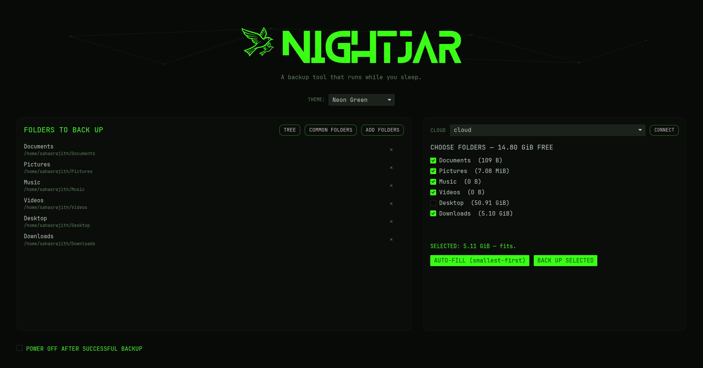
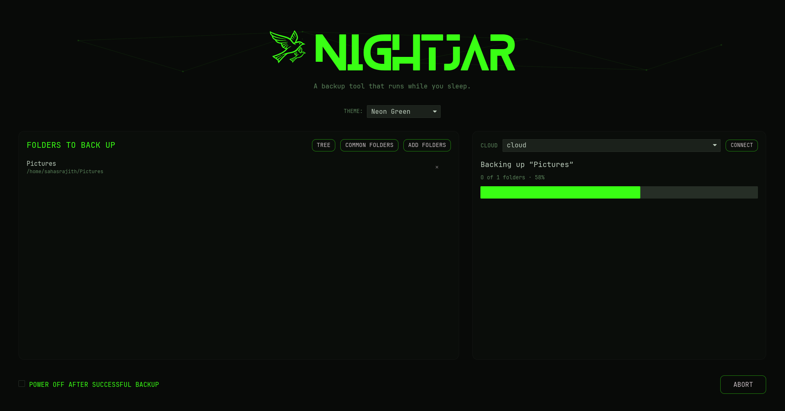
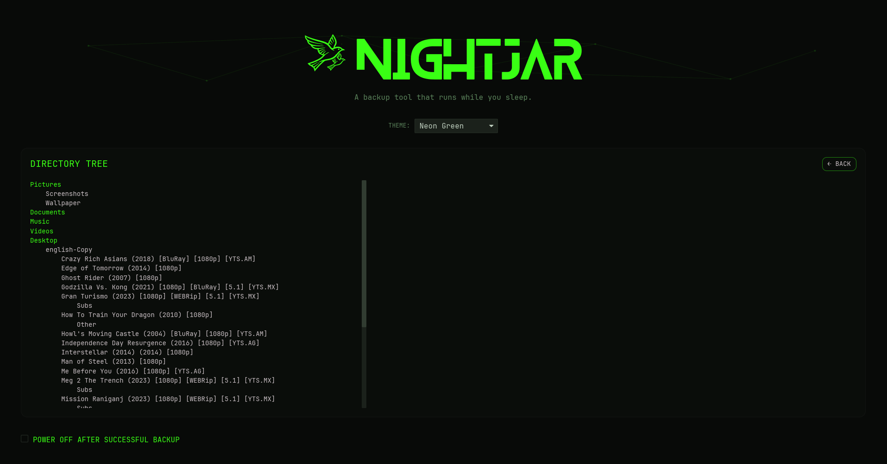

# nightjar

**A robust backup tool that runs while you sleep.**

> 😴 **Allergic to documentation? ** → **[QUICKSTART.md](QUICKSTART.md)** — three commands and you're backing up.

nightjar backs up your folders to the cloud, **verifies** every file arrived intact, and — only if you ask — powers the machine off afterward. It is built around a simple promise: it will never tell you a backup succeeded unless it actually did, and it will never power off your machine on a backup that wasn't fully verified.

It wraps [rclone](https://rclone.org/) (which does the actual transfers and supports 70+ cloud providers) and adds a careful safety layer, a scriptable command-line tool, and a polished desktop interface.

---

## Screenshots

<!-- Replace these with your own screenshots (see docs/ below). -->

| Main window | Backup in progress | Directory tree |
| --- | --- | --- |
|  |  |  |

---

## Features

- **Verified backups.** Every source is copied and then checked against the cloud copy. A backup is only "successful" if every file verified.
- **Optional power-off.** Choose to shut the machine down after a backup — but only ever after a *verified* one. A failed or aborted backup never powers off.
- **Handles "not enough space."** If the cloud doesn't have room for everything, nightjar offers to back up a subset — either automatically (smallest folders first) or a selection you choose — and tells you exactly what it skipped.
- **Guided cloud setup.** Connect a cloud account from the app; it walks you through rclone's own setup so you never have to read a manual.
- **Live progress.** A smooth progress bar driven by real transfer stats.
- **Backup report.** After a backup: what was backed up, how much space it used, and how much cloud space remains.
- **Directory tree viewer.** See the folder structure that will be backed up.
- **Abort anytime.** Stop a running backup cleanly; nightjar reports it as incomplete (never as success).
- **Themed interface.** Seven color themes, including neon-on-black.
- **Two ways to use it.** A graphical app, and a command-line tool suitable for scripts and scheduled (cron) runs.

---

## Compatibility

nightjar is a **Linux** application, developed and tested on Ubuntu. It should
work on most mainstream desktop distributions (Fedora, Debian, Arch, Mint,
Pop!_OS, openSUSE, and similar), with these per-feature requirements:

- **Backups and verification** — work anywhere rclone runs. No special
  requirements beyond rclone itself.
- **Power-off after backup** — requires **systemd** (`systemctl`). On distros
  using other init systems (e.g. Devuan, Void, Gentoo without systemd, Alpine),
  the backup still works; only the optional power-off step is unavailable.
- **The "Add folders" picker** — requires a desktop portal
  (`xdg-desktop-portal`), standard on GNOME and KDE. On minimal or
  window-manager-only setups it may be unavailable; you can still set folders
  via the config file.
- **The guided cloud-connect wizard** — opens your default terminal emulator;
  if none is found, it tells you to run `rclone config` yourself.
- **The desktop app** — needs working graphics drivers (it uses the GPU). On a
  headless server, use the command-line tool instead, which has no GUI
  requirement.

Binaries are built against glibc. For musl-based distributions (e.g. Alpine),
build from source on that system.

macOS and Windows are **not** supported or tested.

---

## Prerequisites

### 1. rclone

nightjar uses rclone to talk to your cloud storage. Install it first:

- **Debian / Ubuntu / Mint:** `sudo apt install rclone`
- **Fedora:** `sudo dnf install rclone`
- **Arch:** `sudo pacman -S rclone`
- **Any distro:** see [rclone.org/install](https://rclone.org/install/)

Verify it is installed:

```sh
rclone version
```
```

### 2. A cloud remote

A "remote" is rclone's name for a configured cloud account (Google Drive, OneDrive, Dropbox, etc.).

**Easiest:** open the nightjar app and click **Connect a cloud account** — it launches rclone's guided setup for you.

**Or set one up manually:**

```sh
rclone config
```

Follow the prompts: choose `n` for a new remote, give it a name (e.g. `cloud`), pick your provider, and when asked *"Use web browser to automatically authenticate?"* choose **Yes** — your browser opens, you sign in, and rclone saves the connection. See [rclone's remote setup docs](https://rclone.org/docs/) for provider-specific notes.

Confirm it worked:

```sh
rclone listremotes
```

You should see your remote name (e.g. `cloud:`).

---

## Installing nightjar

nightjar is built from source with [Rust](https://www.rust-lang.org/tools/install).

```sh
# 1. Install Rust (if you don't have it)
curl --proto '=https' --tlsv1.2 -sSf https://sh.rustup.rs | sh

# 2. Clone and build
git clone https://github.com/Sahasrajith-357/nightjar.git
cd nightjar
cargo build --release
```

The two binaries land in `target/release/`:

- `target/release/nightjar-cli` — the command-line tool
- `target/release/nightjar-gui` — the desktop app

You can run them from there, or copy them somewhere on your `PATH`:

```sh
cp target/release/nightjar-cli ~/.local/bin/nightjar
cp target/release/nightjar-gui ~/.local/bin/nightjar-gui
```

---

## Configuration

nightjar reads a config file at:

```
~/.config/nightjar/config.toml
```

You normally don't need to edit this by hand — the GUI manages it for you. But here is the format:

```toml
# The rclone remote to back up to (without the trailing colon).
remote = "cloud"

# The folder within the remote to back up into.
destination_path = "NightjarBackup"

# The folders to back up. Each has a display name and a path.
[[sources]]
name = "Documents"
path = "/home/you/Documents"

[[sources]]
name = "Pictures"
path = "/home/you/Pictures"

# Verify every file after copying (strongly recommended).
verify = true

# Patterns to skip (caches, build output, version-control internals, etc.).
excludes = [
    "**/.git/**",
    "**/node_modules/**",
    "**/target/**",
    "**/__pycache__/**",
    "**/.venv/**",
    "**/venv/**",
    "**/.cache/**",
    "**/*.tmp",
    "**/*.temp",
    "**/Thumbs.db",
    "**/.DS_Store",
]

# The GUI color theme (optional).
theme = "Ember"
```

If `sources` is empty, nightjar has nothing to back up — add folders in the app, or with the **Common folders** button which fills in your standard user directories.

---

## Using the desktop app

```sh
nightjar-gui
```

The flow:

1. **Connect a cloud account** (first time only) — or pick an existing remote from the dropdown.
2. **Choose folders** — add them individually, or click **Common folders** to add your standard user directories (Documents, Pictures, Music, Videos, Desktop, Downloads). Use **Tree** to preview the directory structure.
3. *(Optional)* tick **Power off after a successful backup**.
4. Click **Back up now**, and watch the live progress.
5. If there isn't enough cloud space, nightjar offers to back up a subset and tells you what it skipped.
6. When it finishes, you get a **report** — folders backed up, space used, space remaining.

You can **Abort** a running backup at any time; nightjar reports it as incomplete and never powers off.

Pick a theme from the selector under the title — seven are included, from warm "Ember" to neon-on-black.

---

## Using the command line

The CLI is ideal for scripts and scheduled (cron) backups — it runs unattended and uses exit codes to report success or failure.

```
nightjar-cli <COMMAND>

Commands:
  backup     Run a backup. Without flags, prompts interactively for any decisions
  preflight  Run all pre-backup checks and report, without transferring anything
```

### Check everything is ready, without transferring

```sh
nightjar-cli preflight
```

Reports whether rclone is installed, the remote is reachable, your sources exist, and whether the backup fits in the available cloud space.

### Run a backup

```sh
nightjar-cli backup
```

`backup` options:

| Flag | Meaning |
| --- | --- |
| `--power-off` | Power off the machine after a *successful, verified* backup. |
| `--partial-method <METHOD>` | If space is short, choose without prompting: `smallest-first` or `custom`. |
| `-y`, `--yes` | Assume "yes" to confirmation prompts (for unattended runs). |

### Unattended / scheduled backups

For a hands-off nightly backup that powers the machine off when done:

```sh
nightjar-cli backup --power-off --partial-method smallest-first -y
```

Because the CLI returns a non-zero exit code on failure and only powers off on a verified backup, it is safe to run from cron or a systemd timer.

---

## How it works (and why it's safe)

nightjar is deliberately conservative with your data:

- **Preflight gates.** Before transferring anything, it checks — in order — that rclone is installed, the remote is configured and reachable, the network is up, and your source folders exist. If any check fails, it stops with a clear message and transfers nothing.
- **Verification.** After copying a folder, nightjar runs an integrity check of the cloud copy against the local files. A folder counts as backed up only if it both copied and verified.
- **Success means success.** A backup is reported successful only if *every* selected folder copied and verified. It stops at the first failure.
- **Power-off is gated.** The machine can only be powered off after a fully verified backup. Internally, the power-off step requires a permit that simply cannot be produced for a failed, partial-failed, or aborted backup — so an unverified backup can never shut your machine down.
- **Honest about partial backups.** If everything doesn't fit, nightjar backs up what it can and tells you exactly which folders it did not.
- **Non-destructive.** nightjar only ever *copies* from your folders to the cloud. It never deletes or modifies your local files.

---

## Building and development

nightjar is a Cargo workspace with three crates:

- `crates/core` — the engine: config, preflight, transfer/verify orchestration, the safety logic. Pure logic is unit-tested; cloud-touching paths have integration tests gated behind `--ignored`.
- `crates/cli` — the command-line front-end.
- `crates/gui` — the desktop app (built with [iced](https://iced.rs/)).

```sh
# Run the test suite
cargo test

# Run the cloud integration tests too (requires a configured remote named "cloud")
cargo test -- --ignored

# Build optimized binaries
cargo build --release
```

---

## Scheduling backups

nightjar doesn't need a built-in scheduler — Linux already has excellent ones.
Because the command-line tool runs unattended and reports success/failure via
exit codes, it's safe to run on a schedule. (If the network or cloud is
unreachable at that time, it fails fast and does nothing — no hang, no harm.)

### Option A — Automatic backups with a systemd timer (recommended)

Run a backup automatically, e.g. every night. Create two files:

`~/.config/systemd/user/nightjar.service`
```ini
[Unit]
Description=nightjar backup

[Service]
Type=oneshot
ExecStart=%h/.local/bin/nightjar-cli backup -y --partial-method smallest-first
```

`~/.config/systemd/user/nightjar.timer`
```ini
[Unit]
Description=Run nightjar backup on a schedule

[Timer]
OnCalendar=daily
Persistent=true

[Install]
WantedBy=timers.target
```

Then enable it:
```sh
systemctl --user daemon-reload
systemctl --user enable --now nightjar.timer
systemctl --user list-timers nightjar.timer   # confirm it's scheduled
```

Change `OnCalendar=daily` to `weekly`, `Mon *-*-* 02:00:00` (Mondays at 2am),
or any [systemd calendar expression](https://www.freedesktop.org/software/systemd/man/systemd.time.html).
(Adjust the `ExecStart` path to wherever your `nightjar-cli` binary lives.)

> **Tip:** to add `--power-off`, the user must be allowed to power off
> non-interactively; on most desktops this works out of the box.

### Option B — Automatic backups with cron

```sh
crontab -e
```
Add a line — e.g. every day at 2am:

### Option C — Just remind me (I'll run it myself)

Prefer to stay in control? Schedule a desktop *notification* instead of an
automatic backup. Add a cron entry that pops a reminder:

```sh
crontab -e
```
(`notify-send` is provided by `libnotify` — `sudo apt install libnotify-bin` if
you don't have it.)

Ready-to-use templates are in [`examples/`](examples/):
- `crontab-reminder.txt` + `nightjar-reminder.sh` — desktop reminders
- `crontab-autobackup.txt` — automatic scheduled backups

---

## License

MIT — see [LICENSE](LICENSE).

## Author

Sahasrajith M
